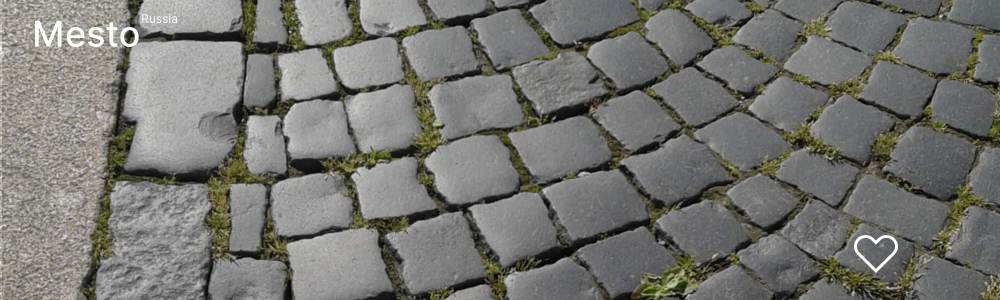

# Проект: Mesto Russia

## О проекте
Перед вами одностраничный сайт, выполненный в рамках обучения в Яндексе Практикуме
по программе Веб-разработчик.
Проект создавался в течение 1/3 третьего курса (модуля) обучения "Базовый JavaScript и работа с браузером": ноябрь 2022 года. Проект представляется из себя первую треть общего проекта за третий курс обучения, который подразумеват постепенное усложнение веб-сайта.

* [Ссылка на сайт проекта](https://eliseye.github.io/mesto/index.html)

* [Ссылка на макет в Figma](https://www.figma.com/file/2cn9N9jSkmxD84oJik7xL7/JavaScript.-Sprint-4?node-id=0%3A1)

Благодаря команде, подготовившей дизайн, на сайте вы можете увидеть:

* Шапку сайта;
* Фотогалерею;
* Подвал сайта;
* Всплывающее окно редактирования профиля пользователя.

О правах и лицензиях:

* Фотографии, использованные в проекте, взяты из личного проекта;
* Шритф Inter имеет свободную и открытую лицензию.

## Технологии

Проект реализован на основе таких технологий как:

* Языки разметки и программирования: HTML, CSS, JavaScript;

    
* БЭМ;
* Файловая структура БЭМ (Nested);
* Flex-блоки;
* Grid Layout;
* Реализована адаптивность интерфейса благодаря использованию медиазапросов - директивы *media*
  с контрольными размерами экрана 1280px и 320px;
* Анимация декоративных элементов и элементов управления;
* Алгоритмы JavaScript реализуют:

  1) Кнопка редактирования профиля при нажатии открывает выплывающее окно формы редактирования профиля;
  2) Работа формы редактирования:
      * Автоматическое заполнение полей ввода текущими значениями профиля;
      * Невозможность сохранить данные профиля с хотя бы одним пустым полем;
      * Возможность закрытия профиля без сохранения изменений;
      * Возможность сохранить изменения данных профиля с последующим автоматическим закрытием окна формы редактирования.

## Функциональность

* Возможеность открывать страницу на устройствах различной шириной от 320px.
  Таким образом, страницу удобно читать как с экрана компьютера, так и с экранов мобилных устройств;
* Возможность редактирования данных профиля пользователя и ставить лайки фотографиям галерии профиля пользователя.

