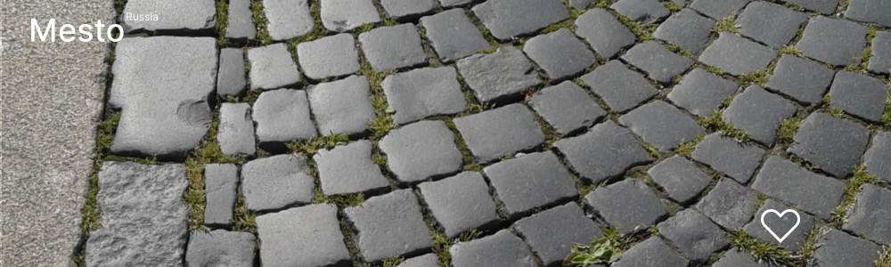

# Проект: Mesto Russia

## О проекте
Перед вами одностраничный сайт, выполненный в рамках обучения в Яндексе Практикуме
по программе Веб-разработчик.
Проект создавался в течение третьего курса (модуля) обучения "Базовый JavaScript и работа с браузером": ноябрь-декабрь 2022 года.
Проект выполнялся в три этапа, которые подразумевают постепенное усложнение веб-сайта, постепенное появление новых функций, что можно увидеть по истории коммитов.
***
В курсе (модуле) "JavaScript — непростые концепции" код проходил через итерации реакторинга:

  upd 11.01.2023 - Проектная работа 7 - Добавлен класс Card и класс FormValidator, данные классы интегрированы в общую логику программы;

  upd 25.01.2023 - Проектная работа 8 - Добавлены классы Section, Popup, PopupWithForm, PopupWithImage, UserInfo. Произведен рефакторинг кода и структуры проекта. Произведена работа по сборки и оптимизации проекта в NPM (Webpack, Babel и другие пакеты);

  upd 04.02.2023 - Проектная работа 9 - Реализована работа с API сервера обработки сервиса размещения фотографий пользователей
    * данные загружаются с сервера: данные пользователя, подборка карточек пользователей
    * данные отправляются на сервер: изменение данных пользователя - Имя, описание профиля, аватар; новая карточка; удаление карточки фотографии, но только своей; установка и снятие лайка у доступных для просмотра добавленных карточек фотографий пользователей. Реализованы элементы UX - пользователь видит момент обработки его действий системой, в случае сбоев с работой API в консоли пишутся коды ошибок.

#

* [Ссылка на сайт проекта](https://eliseye.github.io/mesto/index.html)

* [Ссылка на макет в Figma 1](https://www.figma.com/file/2cn9N9jSkmxD84oJik7xL7/JavaScript.-Sprint-4?node-id=0%3A1)

* [Ссылка на макет в Figma 2](https://www.figma.com/file/bjyvbKKJN2naO0ucURl2Z0/JavaScript.-Sprint-5?node-id=0%3A1)

* [Ссылка на макет в Figma 3](https://www.figma.com/file/kRVLKwYG3d1HGLvh7JFWRT/JavaScript.-Sprint-6?node-id=0%3A1)

* [Ссылка на макет в Figma 4](https://www.figma.com/file/PSdQFRHoxXJFs2FH8IXViF/JavaScript-9-sprint?node-id=0%3A1)

Благодаря команде, подготовившей дизайн, на сайте вы можете увидеть:

* Шапку сайта;
* Фотогалерею;
* Подвал сайта;
* Модельные окна:
    1) Редактирования данных профиля пользователя;
    2) Добавления новой карточки с фотографией в галерею профиля;
    3) Открытия (разварачивания) фотографии из галереи;
    4) Редактирования аватара;
    5) Подтверждения удаления карточки.

О правах и лицензиях:

* Фотографии, использованные в проекте имеют свободную и открытую лицензию;
* Шритф Inter имеет свободную и открытую лицензию.

## Технологии

Проект реализован на основе таких технологий как:

* Языки разметки и программирования: HTML, CSS, JavaScript;

    
* БЭМ;
* Файловая структура БЭМ (Nested);
* Flex-блоки;
* Grid Layout;
* ООП;
* Promise, fetch и взаимодействие с API;
* NPM (Webpack, Babel и другие пакеты сборки и оптимизации проекта);
* Реализована адаптивность интерфейса благодаря использованию медиазапросов - директивы *media*
  с контрольными размерами экрана 1280px и 320px;
* Анимация декоративных элементов и элементов управления, плавность открытия модальных окон;
* Алгоритмы JavaScript реализуют:

  1) Кнопка редактирования профиля при нажатии открывает выплывающее окно формы редактирования профиля;
  2) Работа формы редактирования профиля:
      * Автоматическое заполнение полей ввода текущими значениями профиля;
      * Невозможность сохранить данные профиля с хотя бы одним пустым полем;
      * Возможность закрытия формы редактирования профиля без сохранения изменений;
      * Возможность сохранить изменения данных профиля с последующим автоматическим закрытием окна формы редактирования. Показан момент обработки данных.
  3) Кнопка добавления новой карточки в галерею при нажатии открывает выплывающее окно формы редактирования профиля;
  4) Работа формы добавления новой карточки в галерею:
      * Невозможность добавить карточку с хотя бы одним пустым полем или неверной ссылкой;
      * Возможность закрытия формы добавления;
      * Возможность добавления новой карточки в галерею с последующим автоматическим закрытием окна формы редактирования. Показан момент обработки данных.
  5) Кнопка лайка ставит лайк карточке галереи;
  6) Кнопка корзины удаляет карточку из галереи текущего проифля, но неактивна на карточках других пользователей;
  7) Автозаполнение фотогалереи карточками из имеющегося массива;
  8) Реализована валидация вводимых данных в формы, для чего также изменён стиль уведомлений об ошибках в полях ввода;
  9) Зактытие форм возможно по кнопке - кретику, нажатием кнопки Escape, по тапу на overlay;
  10) Работа формы редактирования аватара профиля:
      * Невозможность сохранить данные профиля с пустым полем;
      * Возможность закрытия формы редактирования профиля без сохранения изменений;
      * Возможность сохранить изменения данных профиля с последующим автоматическим закрытием окна формы редактирования. Показан момент обработки данных.
  11) Работа формы подтверждения удаления карточки фотографии, добавленной пользователем:
      * Возможность закрытия формы подтверждения удаления без подвердения удаления;
      * Возможность подтверждения удаления с последующим автоматическим закрытием окна формы подтверждения удаления. Показан момент обработки данных.

## Функциональность

* Возможеность открывать страницу на устройствах различной шириной от 320px.
  Таким образом, страницу удобно читать как с экрана компьютера, так и с экранов мобилных устройств;
* На странице возможно:
    1) Редактирование данных профиля пользователя - Имя, описание, аватар;
    2) Добавления новой карточки с фотографией в галерею профиля;
    3) Удаление карточки с фотографией из галереи профиля;
    4) Поставить лайк карточке из галереи;
    5) Открытие (разварачивание) фотографии из галереи в отдельном окне;
    6) Просмотр карточек пользователей сервиса и возможность ставить и снимать у них лайки от имени текущего профиля;

